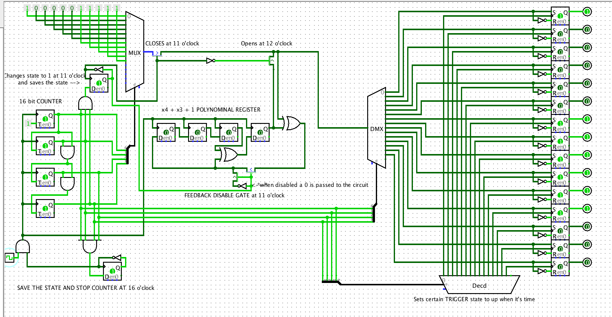
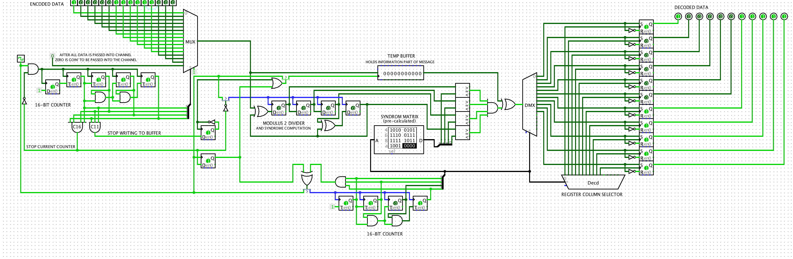

# Cyclic Coders

# Logic Circuits

### Encoder
- [`.circ` file](./encoder.circ)

### Decoder
- [`.circ` file](./decoder.circ)

# Algorithm implementation in C Language
- [Encoder](./encoder.c)
- [Decoder](./decoder.c)
