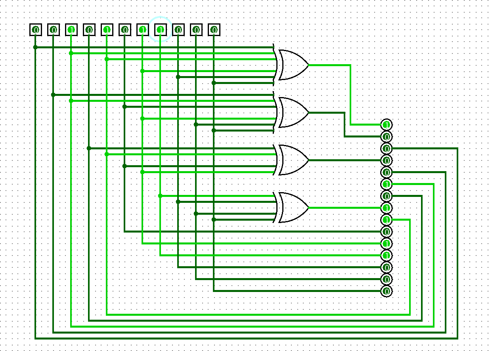
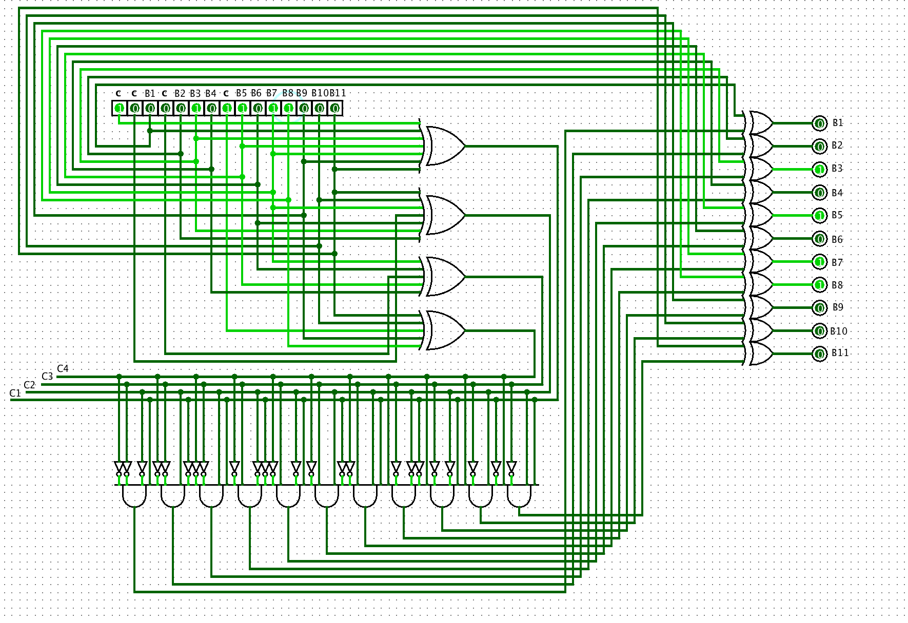

# Hamming Coders

# Logic Circuits
### Encoder
- [`.circ` file](../assets/logisim/hamming_encoder.circ)

### Decoder
- [`.circ` file](../assets/logisim/hamming_decoder.circ)

# Algorithm implementation in C Language
- [Encoder](./encoder.c)
- [Decoder](./decoder.c)
